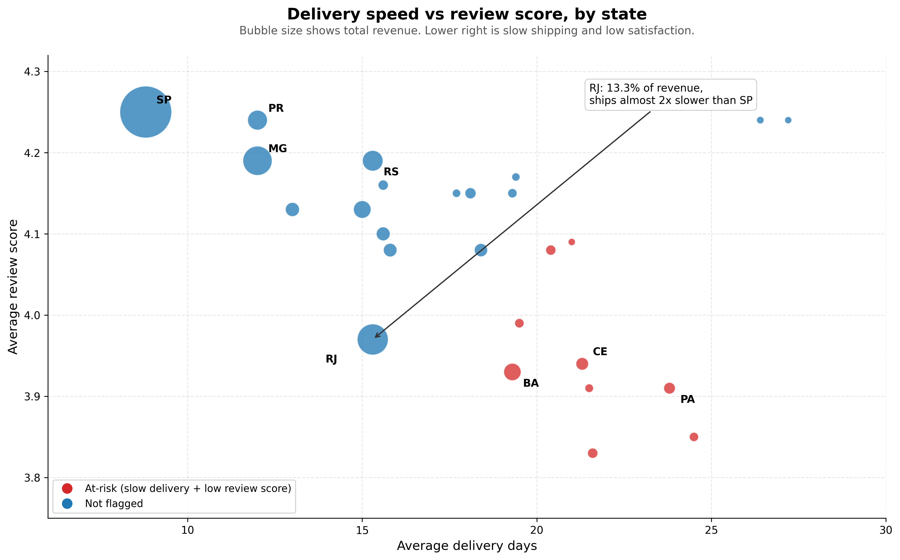
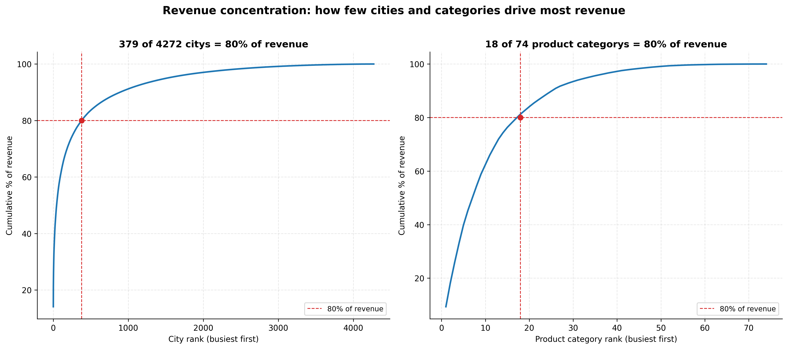

# Olist Brazilian E-Commerce: Delivery Satisfaction Risk and Revenue Exposure

## Problem

Which customer states carry the highest satisfaction risk from slow delivery, and how much revenue is exposed in those states.

Olist is a Brazilian e-commerce marketplace connecting small sellers to major online marketplaces. Delivery in Brazil spans huge distances and inconsistent logistics infrastructure by region. If certain states are both slow to ship and low on customer satisfaction, that is revenue sitting on a foundation of unhappy customers, and it is fixable with a targeted fulfillment change rather than a company-wide one.

## Approach

- Loaded 8 raw CSVs (customers, orders, order items, payments, reviews, products, sellers, geolocation) into a SQLite database, restricted to the 96,478 delivered orders (of 99,441 total), since undelivered orders have no delivery date to score.
- Built a single SQL analysis (sql/olist_analysis.sql) joining orders, customers, reviews, and order items, computing delivery days and delivery delay versus the estimate with date functions, aggregating to the state level, and using window functions to rank states by delivery speed and compute a revenue Pareto curve.
- Flagged states as at-risk when both average delivery days and average review score are worse than the state-level median, then summed revenue in those states to quantify exposure.
- Built the same 4-chart dashboard in Streamlit (interactive app, app.py) and as a Power BI build guide (docs/power_bi_build_guide.md), since Power BI Desktop cannot run outside Windows.

## Findings

- Delivery speed and revenue are both concentrated at the top. SP alone delivers in 8.8 days on average, holds 38.3% of all revenue, and scores 4.25 on reviews, the best state on every measure.
- Revenue is heavily concentrated by state. It takes 7 states, SP, RJ, MG, RS, PR, SC, and BA, to reach 80% of total revenue (81.5% cumulative). The other 19 states together hold the remaining 18.5%.
- RJ is the clearest case of avoidable risk on a large state. It is the second-biggest revenue state at 13.3% of the total, but ships in 15.3 days, almost twice as slow as SP, and scores 3.97, notably below MG, a similarly sized revenue state at 11.7% that ships in 12.0 days and scores 4.19.
- 9 states are flagged at-risk (slower than the 18.85-day median delivery and below the 4.115 median review score): BA, CE, PA, MA, PB, PI, AL, SE, and AC. Together they hold R$1,353,490 in revenue, 10.2% of the total.
- Within that at-risk group, revenue is itself concentrated. BA alone accounts for R$493,584, more than a third of the at-risk total, followed by CE (R$219,757) and PA (R$174,471). Those 3 states together cover R$887,812, 66% of the at-risk revenue base.
- The at-risk states range from 19.3 to 24.5 days average delivery, versus 8.8 days for SP, and score 3.83 to 3.99 on reviews, versus 4.25 for SP.

## Supplementary analysis: which cities, categories, and customer types drive 80% of revenue

This cut was checked separately from the main delivery-risk question, using the same delivered-orders scope and the same revenue definition (item price, freight excluded). All 3 cuts reconcile to the same total: R$13,221,498.11.

- **By city:** 379 of 4,272 cities (8.9%) cover 80% of revenue. Sao Paulo city alone is 14.1% of all revenue, Rio de Janeiro city is 7.2%, and the top 10 cities combined are 33.7%. Revenue is far more concentrated than the classic 80/20 split.
- **By product category:** 18 of 74 categories (24.3%) cover 80% of revenue, close to the classic 80/20 pattern. The top category is beleza_saude (health and beauty) at 9.3%, followed by relogios_presentes (watches and gifts) at 8.8% and cama_mesa_banho (bed, bath, and table) at 7.7%.
- **By customer type:** repeat customers are only 3.0% of the customer base (2,801 of 93,358) but spend R$260.05 on average, 88% more than the R$137.96 average for new customers. Repeat customers still total only 5.51% of revenue, since there are so few of them. This matches the low organic repeat rate flagged in the data exploration notebook.

Read together with the main finding: revenue is concentrated by city and category in a normal, expected way, but retention is where the real gap is. Olist has very few repeat customers, and the ones it has spend noticeably more, which points to customer retention as a second lever worth testing alongside the delivery fix, not a replacement for it.

## Recommendation

Run a fulfillment pilot in BA, CE, and PA first, not all 9 at-risk states at once. Those 3 states cover 66% of the at-risk revenue (R$887,812 of R$1,353,490) for the operational cost of fixing 3 regions instead of 9. Options worth testing: a regional distribution point in Salvador (BA, the largest at-risk state), or a switch to a faster carrier for CE and PA specifically, since both are coastal and reachable by a different logistics route than the slower interior states.

This is a correlational finding, not a proven cause. Treat it as a pilot hypothesis: measure review score and delivery days in BA, CE, and PA for 90 days after the change, and compare against the current 3.83 to 3.94 review score baseline in those states.

## Tech

SQL (SQLite), Python (pandas), Streamlit, Plotly, Power BI (build guide provided)

## Data notes and assumptions

- Analysis excludes orders that were canceled, unavailable, or never shipped (2,963 of 99,441), since they have no delivery date to measure. This is a separate operational problem from delivery speed and is not covered by this analysis.
- Revenue is item price only, freight is excluded, since freight is a shipping cost rather than merchandise revenue.
- product_category_name_translation.csv was not part of the source data used here, so the category cut in the supplementary analysis uses Portuguese category names (e.g. beleza_saude, cama_mesa_banho) rather than English translations. The ranking and percentages are unaffected, only the labels.
- One state (Roraima) was dropped from the state-level table for having fewer than 50 orders, too small a sample to trust the average.
- Repeat purchase rate across the full dataset is 3.12%, checked as a candidate metric but not used as the primary lens, since it leaves too small a sample once split by state.

## Reproducing this analysis

raw_data/ and the local SQLite db are not committed to this repo, they are large and the raw data is already public. To reproduce:
1. Download the 8 CSVs from the Kaggle link below into raw_data/
2. Run the cells in notebooks/01_data_exploration.ipynb, or run sql/olist_analysis.sql against a SQLite db built from those CSVs
3. cleaned_data/state_delivery_satisfaction_revenue.csv (already included) is the output app.py reads from

## Links

- Dashboard: https://olist-delivery-risk.streamlit.app/
- Power BI: [add publish-to-web link after building from docs/power_bi_build_guide.md]
- Data source: [Olist Brazilian E-Commerce dataset, Kaggle](https://www.kaggle.com/olistbr/brazilian-ecommerce)
